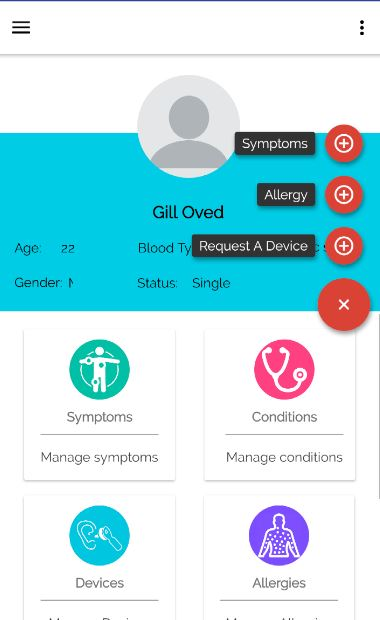
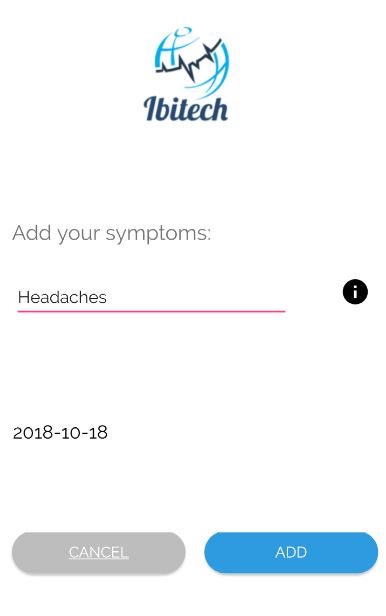
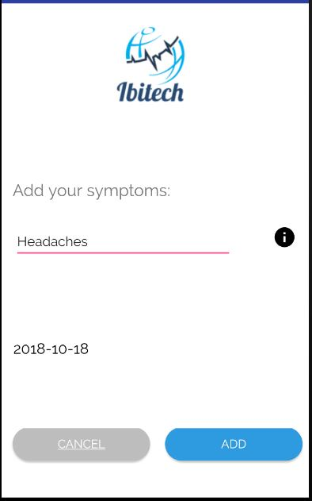

# Ibitech

With a high rise of mismanagement of Medical Health records in South Africa costing  the country millions on a yearly basis.
The existing system does not only fail to protect patients record and confidentiality ,these records are easly damaged since they are papper based .
The result of loss or damage of medical records costs more than 3 Billion each year.
This system aims to eradicate this by creating this system, that will help users information  to be kept in confidentiality ,improve accessability ,make records electronicallly,improve managementr


## Getting Started

Clone or download this repository 

Open the project in the folder of your clone from Android Studio.

To run the project, click on the green arrow at the top of the screen.

### Prerequisites

Download and install Android Studio

Run from Android Studio

Must in position of a smartphone android device.

example Samsung ,Huawei devices

### Installing

A step by step series of examples that tell you how to get a development env running

Say what the step will be
1.Open Android Studio

2.Click Open project 

3.Locate Application

4.Open Application

5.To run the project, click on the green arrow at the top of the screen.

6.Select patient toggle if you are a patient if not select doctor's side 

```
Give the example
```
  .

    

7.User will login ,will be welcomed by user Dashboard

8.Select Functionality on the Dashboard

9.Add Symptom
10.Repeat to other function like Allergies  etc

```
until finished
```

11.Data that is entered is Displayed


## Built With

* [Android Studio](https://developer.android.com/studio//) - The Software we used to test our project
* [My SQL](https://www.mysql.com/) - Our Database Schemer 
* [PHP](http://php.net/) - Programming language
* [Java](https://www.java.com/en/download//) - Used on android to capture data from mark up language
* [XML](https://www.xml.com/) - Used to mark up data in Android Studio


## Authors

* **Ayabonga Jumba**  
* **Asavela Jubherla** 
* **Siphumze Labiti**  


## License

This project is licensed under the MIT License - see the [LICENSE.md](LICENSE.md) file for details

## Acknowledgments

* Cinga Nyangintsimbi (Project Supervisor)
* 3rd YEAR Project 
* Nelson Mandela University
* School Of ICT
